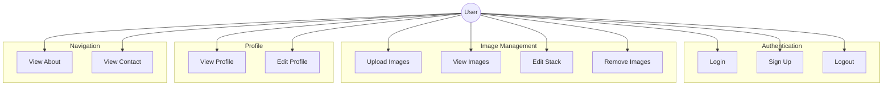
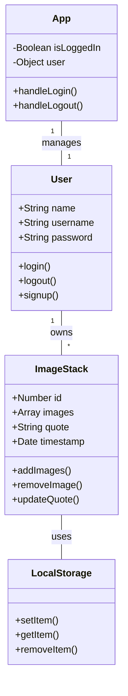
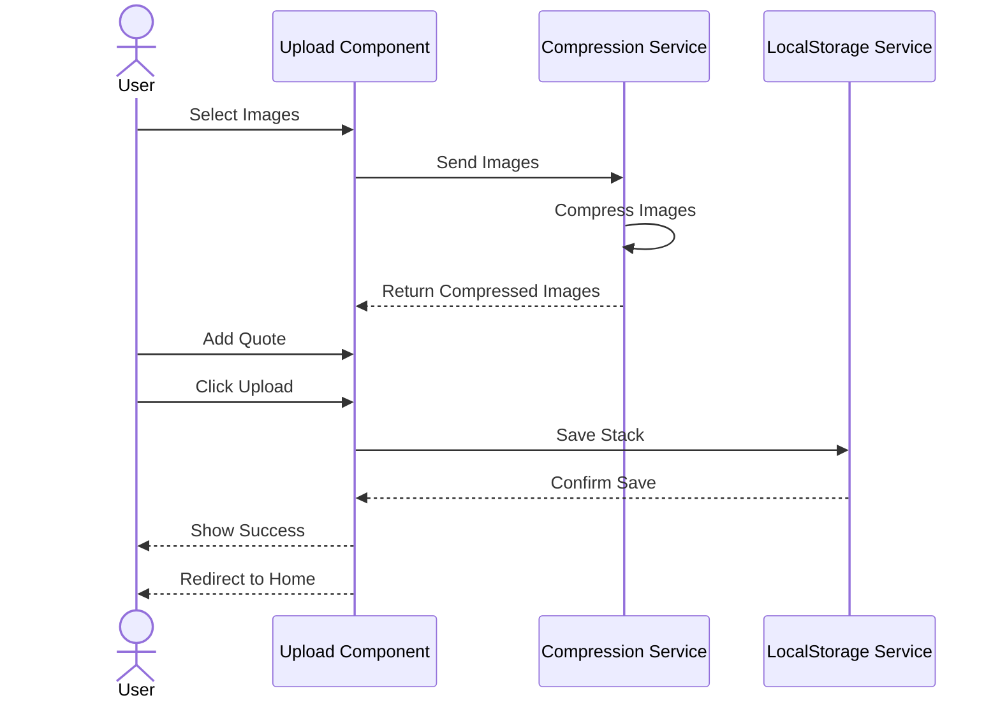

# GCGALL - Graduation Gallery Documentation

## Table of Contents
1. [Functional Requirements](#functional-requirements)
2. [Non-Functional Requirements](#non-functional-requirements)
3. [Use Case Diagram](#use-case-diagram)
4. [Class Diagram](#class-diagram)
5. [Sequence Diagram](#sequence-diagram)

## Functional Requirements

### 1. User Authentication
- Users must be able to sign up with name, username, and password
- Users must be able to log in with username and password
- Users must be able to log out

### 2. Image Management
- Users must be able to upload multiple images as a stack
- Users must be able to add quotes to image stacks
- Users must be able to view all uploaded image stacks
- Users must be able to expand image stacks to view all images
- Users must be able to enlarge individual images
- Users must be able to edit existing image stacks
- Users must be able to remove images from stacks

### 3. Profile Management
- Users must be able to view their profile information
- Users must be able to view their uploaded image stacks
- Users must be able to edit their image stacks

### 4. Navigation
- Users must be able to access Home, Upload, Profile, About, and Contact pages
- Users must be able to view contact information
- Users must be able to view developer information

## Non-Functional Requirements

### 1. Performance
- Image compression must be implemented to handle storage limitations
- The application must handle large image files efficiently
- Page loading time should be under 3 seconds

### 2. Usability
- The interface must be responsive across different screen sizes
- The application must provide clear feedback for user actions
- Navigation must be intuitive and consistent
- The application must have a modern, clean design

### 3. Security
- User data must be stored securely in localStorage
- Unauthorized users must not access protected routes
- Session management must be implemented for logged-in users

### 4. Reliability
- The application must handle storage quota exceeded scenarios
- The application must maintain data consistency
- Error handling must be implemented for all user actions

### 5. Maintainability
- Code must be modular and well-organized
- Components must be reusable
- Styling must use Tailwind CSS for consistency

## Use Case Diagram



## Class Diagram



## Sequence Diagram



## Component Structure

```
src/
├── components/
│   ├── Header.jsx        # Navigation header component
│   └── Footer.jsx        # Footer component with social links
├── pages/
│   ├── Home.jsx          # Landing page with image stacks
│   ├── Upload.jsx        # Image upload functionality
│   ├── Profile.jsx       # User profile and stack management
│   ├── About.jsx         # About page with team information
│   ├── Contact.jsx       # Contact form and information
│   └── Auth.jsx          # Login/Signup functionality
├── App.jsx               # Main application component
└── index.css            # Global styles and Tailwind utilities
```

## Technologies Used

### Frontend Framework
- React.js (v18+)
- React Router for navigation
- Tailwind CSS for styling

### Storage
- LocalStorage API for data persistence
- File Reader API for image handling
- Canvas API for image compression

### Development Tools
- Vite for build tooling
- npm for package management
- Git for version control

## Installation and Setup

1. Clone the repository:
```bash
git clone [repository-url]
```

2. Install dependencies:
```bash
npm install
```

3. Start development server:
```bash
npm run dev
```

4. Build for production:
```bash
npm run build
```

## Future Enhancements

1. Backend Integration
   - Implement proper database storage
   - Add server-side image processing
   - Enable real-time updates

2. Authentication Improvements
   - Add OAuth integration
   - Implement JWT authentication
   - Add password recovery

3. Feature Additions
   - Image filters and effects
   - Social sharing capabilities
   - Comments and reactions
   - User following system

4. Performance Optimizations
   - Implement lazy loading
   - Add service worker for offline support
   - Implement CDN for image delivery

## Known Limitations

1. Storage
   - Limited by localStorage capacity
   - No persistent storage across devices
   - Image compression may affect quality

2. Authentication
   - Basic implementation without proper security
   - No password recovery option
   - Session management limitations

3. Performance
   - Large images may cause loading delays
   - No offline support
   - Limited by client-side processing

## Support and Contact

For support or inquiries, please contact:
- Email: contact@gcgall.com
- Phone: +251 912 345 678
- Location: Addis Ababa, Ethiopia

## License

This project is licensed under the MIT License - see the LICENSE file for details.

---

Documentation last updated: June 2023